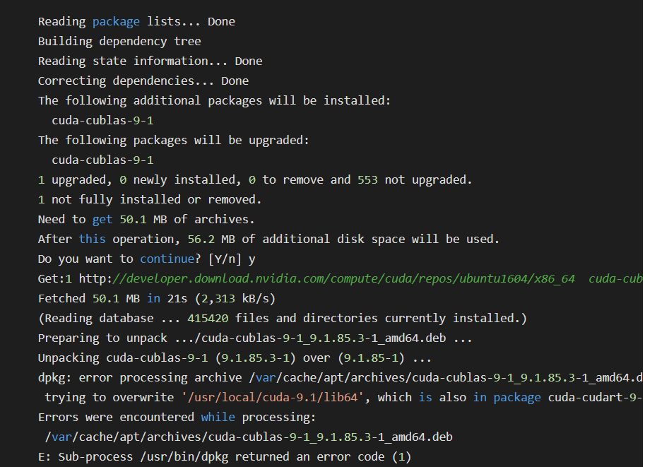
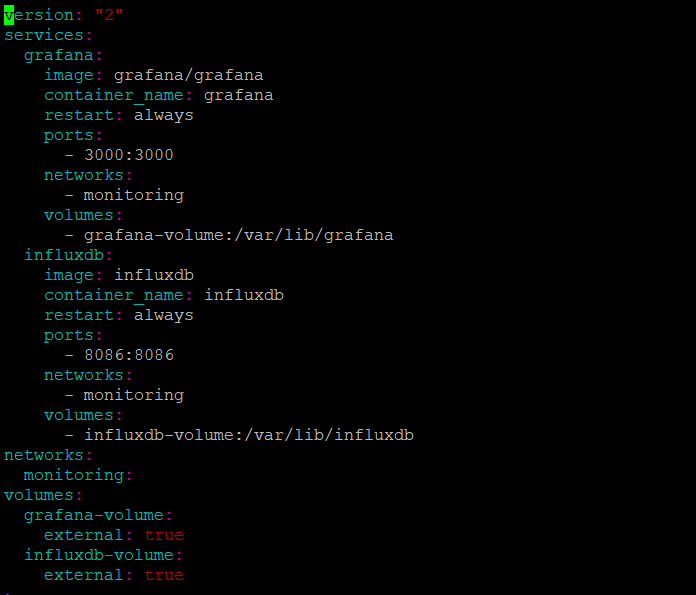

# Dell-Edge-Computer-Docker-InfluxDB-Grafana-Node-Red-and-ChirpStack
Dell Edge Computer, Docker, InfluxDB, Grafana, Node-Red and ChirpStack

Hi all, there is a very quick guide how to configure a system monitoring for one or more servers using a modern stack of technologies, 
like Node-Red, Grafana, Docker and Telegraf with Influxdb.

The main goal for this article is to show how to start getting system metrics from your servers quick and easy, 
without spending lot of time for configuring big and complicated monitoring systems. 
Especially if you only need to take care for few Web servers instead of monitoring big company infrastructure with hundreds of devices.

We’ll use Docker, for the quick deployment our monitoring system, also it’ll gives us a freedom to use any software with dependency free and keep our system clean after. 
Topical, you can look at Docker from this side too, as a cross-platform package system.

Also, we’ll use part of Tick stack, namely an Influxdb base to store our metrics and Telegraf, like an agent on remote system, for nice and pretty graphs we’ll take Grafana.

Legend:

Dell Edge Computer,

	By default, it was installed Ubuntu 18.04 LTS. Then I update the latest version ubuntu 20.04.3 LTS.

	sequence from 18.04 to 20.04
  $ sudo apt update
  $ sudo apt upgrade
  $ sudo apt dist-upgrade
  $ sudo apt autoremove
  $ sudo do-release-upgrade -d -f DistUpgradeViewGtk3

	After that I got some error. For this reason, when I try to install or update, it showed below error. 

Error:  

Ubuntu – dpkg: error processing archive /var/cache/apt/archives/cuda-cublas-9-1_9.1.85.3-1_amd64.deb (–unpack)

Solve: 

The "trying to overwrite" error implies that i have conflicting packages in my system. I try overwriting the package (can be a bit risky).

  $sudo dpkg -i --force-overwrite /var/cache/apt/archives/cuda-cublas-9-1_9.1.85.3-1_amd64.deb 

If that doesn't fix it, you can remove the package and re-install it.

  $sudo dpkg -P cuda-cublas
  
Install Docker on Dell server,

At first, we should install docker engine on ubuntu 20.04 LTS. Let’s do it by this command.

  $ sudo apt install docker.io
  $ docker –version
	$ sudo systemctl enable –now docker
	$ sudo systemctl status docker
  
It will show,

For final check we can run,
	$ sudo docker run hello world
	$ sudo docker ls -a
Manage docker as a non-root user,
	$ sudo groupadd docker
	$ sudo usermod -aG docker $USER (User mean your system username)
	$ newgrp docker
 Verify that you can run docker commands without sudo. 

Finally, install docker composer when we will run docker.yml file. That time we should use docker composer. 

  $ sudo curl -L "https://github.com/docker/compose/releases/download/1.29.2/docker-compose-$(uname -s)-$(uname -m)" -o /usr/local/bin/docker-compose
  
Apply executable permission to the binary:

  $ sudo chmod +x /usr/local/bin/docker-compose
  $ docker-compose --version

Now we will install Influxdb and Grafana both with docker-compose.yml.
At first, we need to create folder for our project, for example /opt/monitoring,

  $ mkdir /opt/monitoring && cd /opt/monitoring
  
Inside directory we need to create docker-compose.yml file with Grafana and Influxdv services:

  $ vi docker-compose.yml
  

Now we need to create this docker network and volumes:
  $ docker network create monitoring
  $ docker volume create grafana-volume
  $ docker volume create influxdb-volume

Make sure that all created fine,

As we can see the network and volumes was created OK, now we need to prepare the Influxdb parameters, for this we’ll run the container with some environment variables for creating database and users:

	$ docker run --rm \
	  -e INFLUXDB_DB=TESTDB -e INFLUXDB_ADMIN_ENABLED=true \
	  -e INFLUXDB_ADMIN_USER=admin \
	  -e INFLUXDB_ADMIN_PASSWORD=admin \
	  -e INFLUXDB_USER=TESTDB -e INFLUXDB_USER_PASSWORD=admin \
	  -v influxdb-volume:/var/lib/influxdb \
	  influxdb /init-influxdb.sh

Finally, all preparations are done, and we ready to start our new monitoring system, will do it by using docker-compose, go to the /opt/monitoring and run:

  $ docker-compose up -d
  
OK, all containers are created and started, so our monitoring system ready to serve incoming requests. We expose few ports, as you can see in docker-compose file, the 8086 HTTP API port for Influxdb data and port 3000 for Grafana web UI.
And we almost done with our new monitoring system, it’s really quick and easy using Docker. To fully complete we only need to configure Grafana a bit, create a dashboard and new data source for Influxdb.
For this will go to our server1 public_ip:3000 (192.168.0.1:3000 in our example) in browser, and login to the Grafana web UI for very first time using:
	login: admin
	password:admin

Then Grafana will ask you to change password, and after that you’ll get inside:

Select the Add data source menu to tell Grafana where to get the Influxdb data:

There we need to select Type = TESTDB, give the Name for this data source, then put the URL using our influxdb container name as address. As I say previously Docker give to us an easy service discovery so. OK, we also need to insert the Database name and user/password for our database, these parameters were created by previously running the Influxdb container. Click on Save & Test to see that your data source is OK:

Great we just added our influxdb as data source for Grafana, for the time economy we’ll take a prepared dashboard that contains most popular parameters, go to the grafana.com and select one you like. For example, this:

Well done now we have a nice 😊 dashboard for minimum of time:

For more information, please follow below links:

https://www.youtube.com/watch?v=xWnI3sHMbGI&t=156s
https://towardsdatascience.com/get-system-metrics-for-5-min-with-docker-telegraf-influxdb-and-grafana-97cfd957f0ac

InfluxDB Database,

Problem solutions:

If we fail to login influxdb server by influx command, what will we do?

Ans:

$sudo apt update
$sudo systemctl enable influxdb
$sudo systemctl unmask influxdb
$sudo systemctl start influxdb

$ influx
$ CREATE USER admin WITH PASSWORD 'admin' WITH ALL PRIVILEGES
exit
$ sudo nano /etc/influxdb/influxdb.conf

HTTP

enable = true

bind-address: 8086

For more information, please follow below links:

https://www.superhouse.tv/41-datalogging-with-mqtt-node-red-influxdb-and-grafana/

Visit our official website: https://polisea.ro/aiot/ 

🚩 Connect with me on social
- LinkedIn: https://www.linkedin.com/in/ariful-islam-arif-2987b51a3/
- Twitter: https://twitter.com/arifulislam301
- Instagram: https://www.instagram.com/ariful_mr_islam/

🔔 Subscribe to my YouTube channel
https://www.youtube.com/channel/UCED68cm6nHaAlAk0h9I3yAQ
